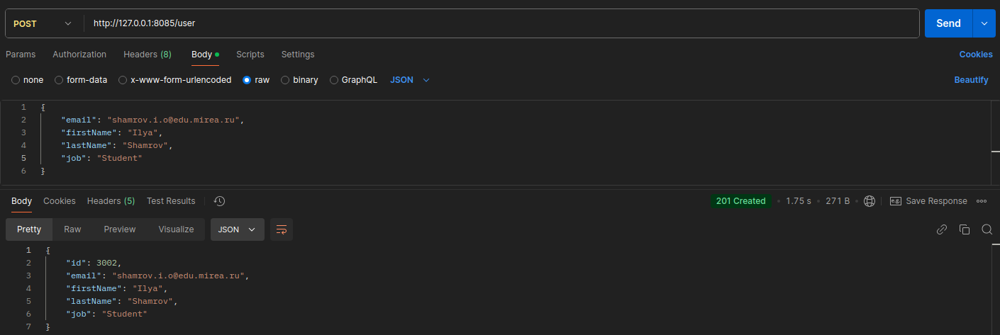
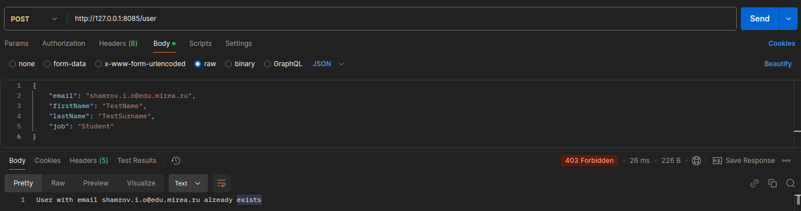
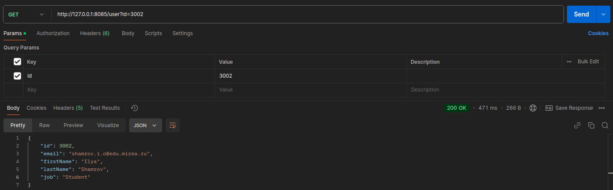
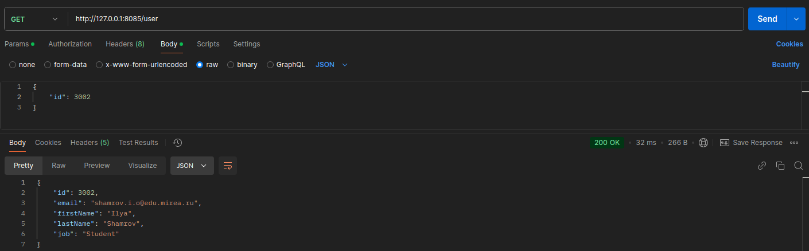
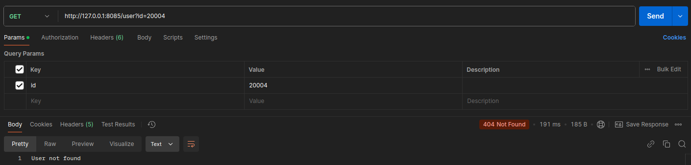
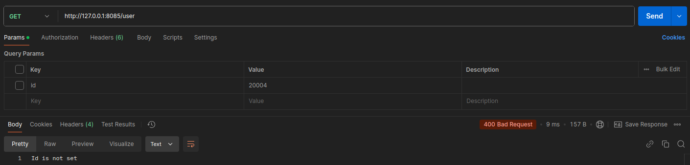

# Аудиторная работа #5. CRUD приложение на Spring Boot

### Запрос на добавление нового пользователя (POST)

#### Пользователь успешно создан

#### Пользователь с такой почтой уже существует

### Запрос на получение пользователя (GET)

#### Число из параметров запрос

#### Число из тела запроса

#### Пользователь с таким id не найден

#### Никакой параметр не передан

